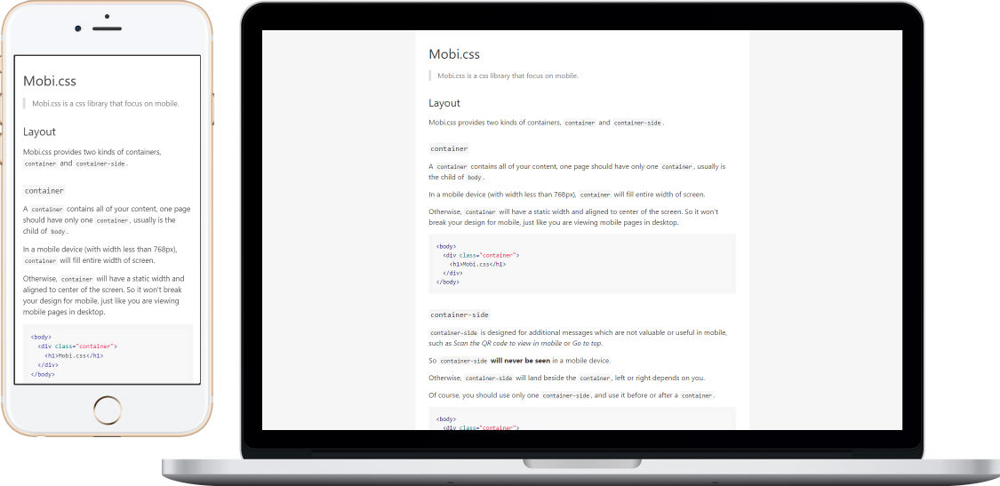
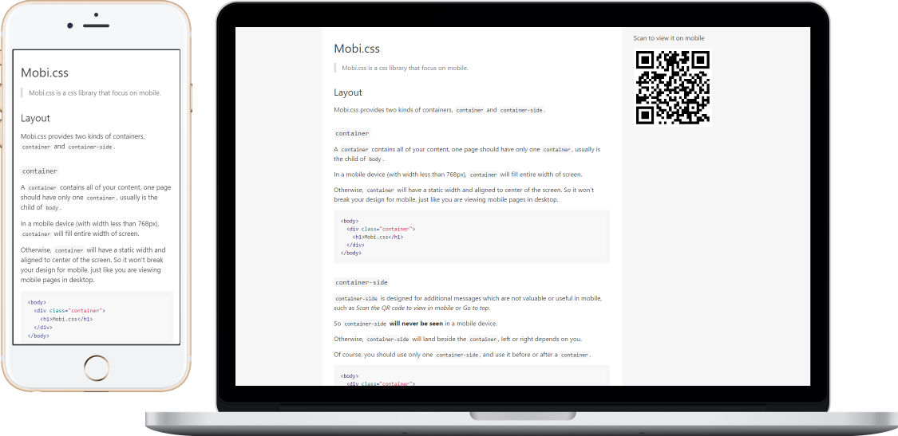

## Layout

Mobi.css provides two kinds of containers, `container` and `container-side`.

### `container`

A `container` contains all of your content, one page should have only one `container`, usually is the child of `body`.

In a mobile device (with width less than 768px), `container` will fill entire width of screen.

Otherwise, `container` will have a static width and aligned to center of the screen. So it won't break your design for mobile, just like you are viewing mobile pages in desktop.



```html
<body>
  <div class="container">
    <h1>Mobi.css</h1>
  </div>
</body>
```

### `container-side`

`container-side` is designed for additional messages which are not valuable or useful in mobile, such as *Scan the QR code to view in mobile* or *Go to top*.

So `container-side` **will never be seen** in a mobile device.

Otherwise, `container-side` will land beside the `container`, left or right depends on you.

Of course, you should use only one `container-side`, and use it before or after a `container`.



```html
<body>
  <div class="container">
    <h1>Mobi.css</h1>
  </div>
  <div class="container-side">
    <p>Scan the QR code to view in mobile</p>
    
  </div>
</body>
```
